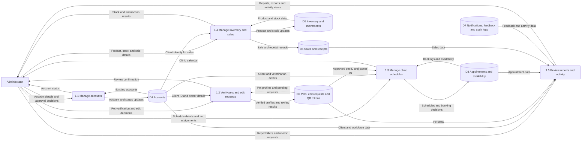
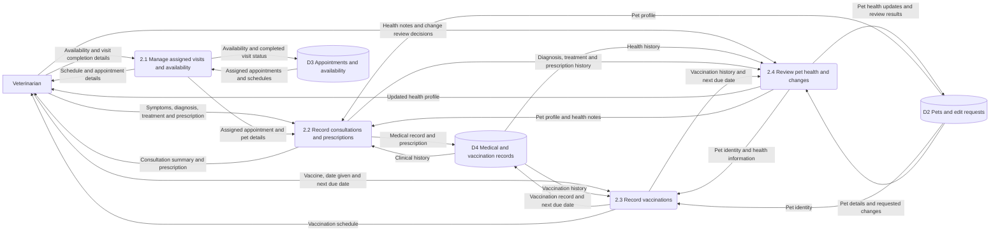
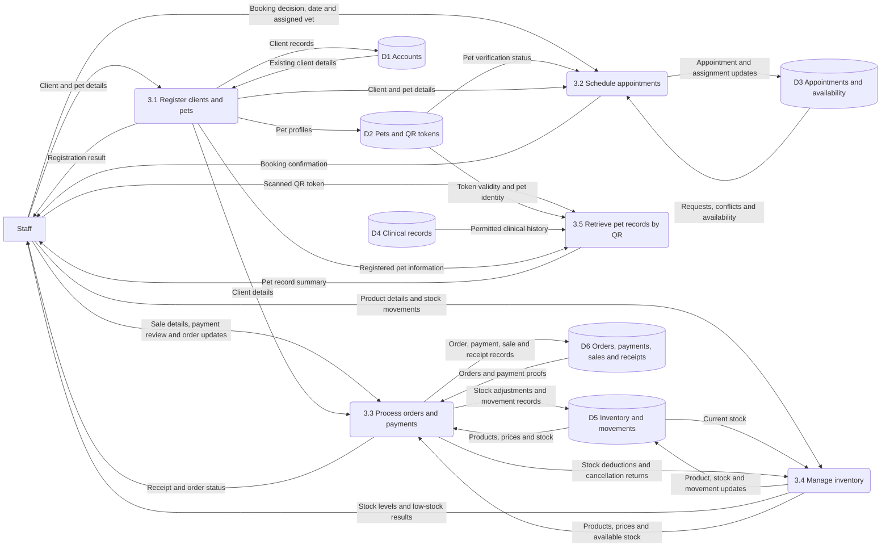
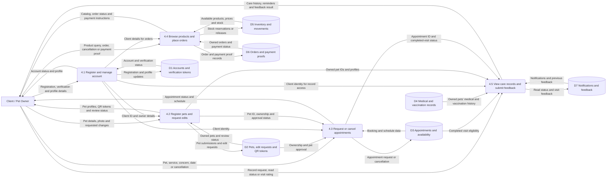

# Vetrix — Data Flow Diagrams by Role

Four simplified Level 1 role views, based on the PHP website and mobile API source in this workspace.

**Version note:** This Markdown preserves the original source-code-based diagrams. The current editable diagrams have been revised to match the user's supplied ERD; their numbering and table names are documented in [ERD-DATA-STORES.md](diagrams/ERD-DATA-STORES.md).

Rectangles represent external users, rounded boxes represent processes, and cylinders represent logical data stores. Labeled arrows represent data, not the order of steps. Store IDs are shared across diagrams; each diagram shows the relevant portion of a store.

The Client/Pet Owner view follows `api/mobile/v1`. Client sign-in is blocked on the clinic website; client interactions here refer to the mobile API. Source inspection does not confirm a deployed mobile app.

Login/session validation, routine audit writes, file storage and email delivery are omitted to keep these role views readable. These are selected business-process views, not an exhaustive, balanced decomposition of a system context diagram.

## Administrator

## Veterinarian

## Staff

## Client / Pet Owner — mobile API

## Logical data store mapping

| Store | Source tables |
| --- | --- |
| D1 Accounts | users, account_verification_tokens, mobile_api_tokens |
| D2 Pet information | pets, edit_requests, qr_tokens |
| D3 Scheduling | appointments, staff_availability |
| D4 Clinical records | medical_records, vaccinations |
| D5 Inventory | inventory_items, inventory_movements, inventory_restock_alerts |
| D6 Orders and sales | product_orders, product_order_items, product_order_proofs, product_order_gcash_references, product_order_bank_references, product_order_recipients, product_payment_settings, product_payment_accounts, pos_transactions, pos_transaction_items, pos_receipts |
| D7 Communication and oversight | notifications, product_order_notifications, feedback, audit_logs, email_outbox |

## Interpretation notes

- Processes mediate all access to stored data. Users never connect directly to stores.
- Direct process-to-process arrows in the veterinarian, staff and client views summarize logical data dependencies. The application implements these dependencies through the shared stores also shown; these arrows do not assert direct function calls or an additional transfer mechanism.
- Shared stores connect the role views: client requests become clinic work; clinical entries become client-visible care history.
- Pet booking depends on ownership and approval. Scheduling also checks conflicts and workforce availability.
- Pet edit submissions are requests for review; they do not imply immediate approval.
- The order code reserves available stock and records inventory movements, and restores stock when applicable. Payment proofs are reviewed by staff.
- Medical and vaccination records are grouped logically in D4; a client's read access does not grant clinical editing permission.
- Product order and payment stores are defined in migrations and runtime schema helpers, beyond the original base SQL schema.

## Source references

- Role menus: `includes/admin_sidebar.php`, `includes/vet_sidebar.php`, `includes/staff_sidebar.php`.
- Website workflows: `admin/`, `vet/`, `staff/`.
- Client workflows: `api/mobile/v1/register.php`, `profile.php`, `pets.php`, `pet_edit_requests.php`, `appointments.php`, `orders.php`, `bootstrap.php`, `feedback.php`.
- Order and stock behavior: `includes/product_orders.php`, `includes/product_order_pos_checkout.php`.
- Schema: `vetrix.sql`, `migrations/product_orders.sql`, `migrations/payment_accounts.sql`.
